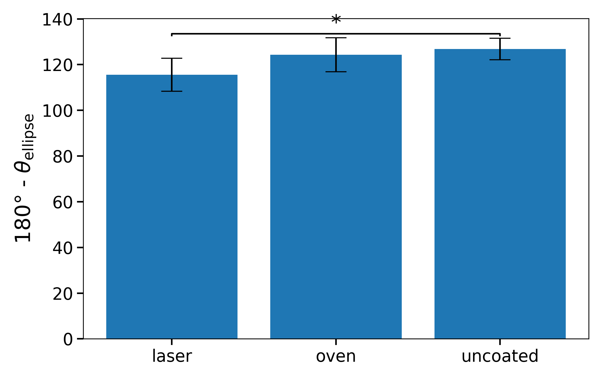

# Contact Angle Analysis

## File Structure
- `contactangles.py`: analysis and plotting script
- `contactAngles.csv`: input data (tab-delimited)
- `raw-images/`: folder containing original images
- `processed-images/`: folder containing processed images and angle overlays

## Resources

 - Marco Brugnara's plugin .jar file: https://imagej.net/ij/plugins/contact-angle.html
 - ChemEd paper with a bunch of references: https://pubs.acs.org/doi/full/10.1021/ed100468u